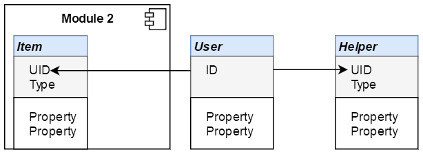
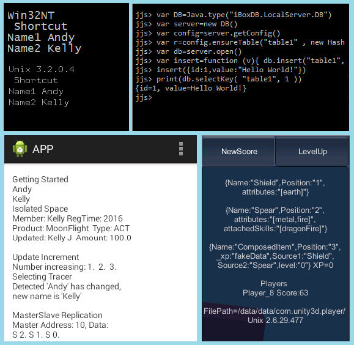

### e^d = Ne^(Kd)  [2021-11-21]   0^0-e-LD-time-WE-light-HD  [2021-12-26]  e^(d+1) = Ne^(d+ln(e/N)) [2022-01-03] 

### C = |e^(Xi)|;   time = e^(Xi) - e^(0i)  [2022-01-29] 

### F = [LD,HD,WE] = [ i+e^0, -i+e^0, -1-e^0 ]; |FWE| > |FLD,FHD|  [2022-03-06]   

# iBoxDB  

## Fast ACID Table-Style Document NoSQL Database


## Project Description


iBoxDB is a fast acid table-style document NoSQL Embedded Database, easily store objects and documents, traditional table with unstructured data, zero configuration, pure JAVA and DotNET engines, no dependencies.


iBoxDB has a well designed interface with great performance and capability for agile development. You can create applications with database services embedded and deploy it on mobiles, desktops, servers, to locally persist your data from anywhere. 


**Green**, low carbon emission!


Dual Core Application Database 


 For &nbsp; JAVA,   C#,   Android,   Unity,   Xamarin,   Mono,   Linux,   Windows... 


[Download Assemblies](https://sourceforge.net/settings/mirror_choices?projectname=application-database&filename=iBoxDBv31_31.zip&selected=pilotfiber)


[Download Mirror](https://github.com/iboxdb/hijk/raw/dependencies/kits/iBoxDBv31_31.zip)


[Website Mirror https://iboxdb.github.io/](https://iboxdb.github.io/)


## Features

* CRUD and Forward CRUD
* KeyValue and KeyOnly tables
* Unique and non-unique indexes
* Unique and non-unique composite indexes
* SQL like query language
* Transactions support
* Concurrency control, thread safe
* Multiple applications supported
* Memory management
* Scalable hot MasterMaster and MasterSlave replications
* Hot mirror copy
* On disk and in memory databases supported
* Automatically create databases
* Zero configuration, copy and run, purely managed code
* Dynamic columns
* Prototype columns
* Different types with different indexes can be stored in same table
* Persistence + ORM + Cache + Embeddable, ONE STOP solution
* Ason, Array Script Object Notation
* High performance, no dependencies
* Transaction Huggers
* Directly Select
* Update Increment
* Selecting Tracer
* Snapshot-Serializable Isolation
* JAVA6+  &nbsp;&nbsp;  .NET2+

## Examples

### Each box is an ISOLATED data space (transaction-based)

```cs
  using(var box = auto.Cube())
  {                            
     //select, insert, update, delete ...
     CommitResult cr = box.Commit();
  }
```

```java
  try(Box box = auto.cube()){
     ...
     CommitResult cr = box.commit();
  }  
```

### Normal Object

```cs
  Member m = new Member();  
  m.Id = box.NewId();
  m.Name = "Andy";
  m.Password = EncodePassowrd("123");
  box["Member"].Insert(m);
```

```java
  Member m = new Member();
  m.Id = box.newId();
  m.Name = "Kevin";
  box.d("Member").insert(m); 
```

### Dynamic Object (document database)

```cs
  //Game : Dictionary<string, object>
  game["GameType"] = "ACT";
  box["Product"].Insert(game);
```

```java
  //Game extends HashMap<String,Object>
  game.put("GameType", "ACT");
  box.d("Product").insert(game);  
```

### Key Value Style Query

```cs
  box["Table", 2L].Select<Member>();
   //Composite Key
  box["Table2", 99, "ABC"].Select<Product>();
```

```java
  box.d("Table", 3L).select(Member.class);
  //Composite Key
  box.d("Table2", 88, "ABC").select(Product.class);  
```

### Composite Key Supported

 ```java
 config.ensureTable(Item.class, "Item", "UID", "Type")
 ```
  



### SQL Like

```cs
  /* 
  from TABLE where A>? & B<=? order by C limit 0,10

  from [table] where [condition] 
                      order by [field1] desc,[field2] limit [0,10]
  [Condition:] == != < <= > >= & | ( )
  */ 
  box.Select<Member>("from Member where Name==?", "MyName");
  box.select(Member.class, "from Member where Name==?", "MyName"); 
```

### Query

```cs
  //query
  box.Select("from Member");
  //load to memory first, startswith '*'
  box.Select("*from Member");
  //selecting tracer, startswith '!'
  box.Select("!from Member")  
```

### Index, make Select hundred times faster in average

```cs
  config.EnsureIndex<Member>("Member", "Field1","Field2")
  config.ensureIndex(Member.class, "Member", isUnique,"Field1","Field2")
  box.Select("from Member where Field1 == ? & Field2 == ?",arg1,arg2)
```
```cs
  //Id on the Left would faster in many cases
  box.Select("from Member where Id == ? & Field == ?",id,arg)
```
```cs
  //combining Results would faster than OR,
  //depends on the scale of dataset and corresponded Index configure.	
  //where Id == ? | Id == ? | Id == ?
  foreach(var id in [ 1, 2, 3 ])
    combiner.Add( box.Select("from Member where Id == ?",id) )
```

### Custom QueryFunction

```cs
  box.Select<Member>("from Member where [Tags]", new IFunction("Value"))
```

### Weak Object 

```java
 //Strongly typed
box.select("from Table where Id > ?" , 1L);
//Weak Object
box.select("from Table where Id > ?" , new Variant("1"));  
```

### Compatible with LINQ (.NET)

```cs
  from o in box.Select<Member>("from Member")
  where o.Text.Contains(text) select o;
```

### Compatible with Stream (Java)

```java
  StreamSupport
   .stream(box.select(Member.class,"from Member").spliterator(), true)
   .collect(groupingBy(m -> m.group, summarizingLong(m -> m.value)))
```

### Directly Select

```cs
  //Select records from a samll file directly
  //without initializing database                   
  IEnumerable records = DB.Select(fileAddress) 
```


### Ason & Prototype Columns

```java
  //define prototype, Id is Long		
  Ason prototype = new Ason("Id:", 0L, "Name:", "Guest");

  Ason record = prototype.select();
  //set Id as String,
  record.set("Id", "123");
  //will automatically convert to Long as the prototype
  System.out.println("Output: " + record.get("Id").getClass());
  //Output: class java.lang.Long
```


### Transaction Huggers

```cs
  //Three transactions committed together
  long huggersBuffer = 1024L * 1024L * 32L;                   
  box1.Commit(huggersBuffer);
  box2.Commit(huggersBuffer);
  box3.Commit(); 
 ```


### Forward CRUD 

```java
try (Box box = auto.cube()) { 
   // forward Update()
   Member m = box.d("Table", 100L).update(Member.class); 
   m.setName("Name"); 
   m.setAmount(BigDecimal.TEN); 
   CommitResult cr = box.commit(); 
}
```

### Snapshot-Serializable Transaction


Transaction Step | Isolation Level
---------------- | ---------------
Application Point | Snapshot 
Database Point | Serializable 

```cs
using(var box = auto.Cube()){
  //Snapshot...
  box.Commit( ()=>{
    //Serializable...  
  });                            
}
```

### Update Increment

&nbsp; | Apply To | Trigger | Type 
------ | -------- | ------- | ----
**UpdateIncrement** | non-primary key | insert/update | long 
AutoIncrement | primary key | insert | number 


&nbsp; | Value From | Generator Time
------ | ---------- | --------------
**UpdateIncrement** | Database NewId(MaxPos,1) | Serializable Transaction Commit 
AutoIncrement | Table Max(ID)+1 | Data Insert, Differed from Commit order 


### Selecting Tracer

&nbsp; | Thread | Usage 
------ | ------ | -----
**Tracer** | non-blocked | read/write different records  
Locker | blocked | read/write same record  


### IO

BoxFileStreamConfig |
------------------- |  
BoxMemoryStreamConfig |
ReadonlyStreamConfig |
CacheStreamConfig |


### Database Path
#### C# & JAVA,  place outside IDE working directory can get better performance 

```cs
//different path has hugely different writing speed on VM.
IBoxDB.LocalServer.DB.Root("/data/") 
```

#### ASP.NET Cross Platform 

```cs
DB.Root(MapPath("~/App_Data/"))
```

#### Xamarin 

```cs
DB.Root(System.Environment.GetFolderPath(
  System.Environment.SpecialFolder.LocalApplicationData/Personal))
```

#### Unity3D 

```cs
DB.Root(Application.persistentDataPath)
```

#### Android 

```java
DB.root(android.os.Environment.getDataDirectory()
       .getAbsolutePath() + "/data/" + packageName + "/") 
```

#### JSP WebApplication

```java
@WebListener()
public class StartListener implements ServletContextListener {
    @Override
    public void contextInitialized(ServletContextEvent sce) {
       String path = System.getProperty("user.home") + "/data/"; 
       new File(path).mkdirs();   
       DB.root(path); 
    }
} 
```

### Getting Started   C# and Java

```cs
 using IBoxDB.LocalServer;

 var db = new DB();
 db.GetConfig().EnsureTable<Record>("Table", "Id");
 AutoBox auto = db.Open();

 auto.Insert("Table", new Record { Id = 1L, Name = "Andy" });
 var record = auto.Get<Record>("Table", 1L);
 record.Name = "Kelly";
 auto.Update("Table", record);
 auto.Delete("Table", 1L);  
```

```java
 import iboxdb.localserver.*;

 DB db = new DB();
 db.getConfig().ensureTable(Record.class, "Table", "Id");
 AutoBox auto = db.open();

 auto.insert("Table", new Record(1L, "Andy"));
 Record record = auto.get(Record.class, "Table", 1L);
 record.Name = "Kelly";
 auto.update("Table", record);
 auto.delete("Table", 1L);  
 ```

### Memory Usage

```java
 DatabaseConfig cfg = db.getConfig();
 //Cache Memory, set less 1/3 total
 cfg.CacheLength = cfg.mb(1024L);
 //Read Pool, set **8+** to low memory machine
 cfg.ReadStreamCount = 8;
 //Write Pool, set **4-** to low memory machine
 cfg.WriteStreamCount = 1;
```

### Schemata 

```java
  auto.getDatabase().getSchemata() 
```

### Mirror Copy

```cs
  auto.GetDatabase().CopyTo(new Mirror(bakAddr, bakRoot), buffer) 
```


### Replication

```java
  BoxData.masterReplicate(masterB, data)
  BoxData.slaveReplicate(slaveB, data)
```

### Changed Values 

```cs
using IBoxDB.LocalServer.Replication;
DB db = new DB();
db.SetBoxRecycler(
  (Socket socket, BoxData outBox, bool normalPoweroff) => {
    if (socket.Actions > 0) {
      foreach (var e in outBox.GetActions()) {
        var actionType = e.ActionType;
        var key = e.Key;
        if (actionType == ActionType.Begin) {
	      continue;
        }

        var tableName = e.TableName;
        var value = e.Select();
        Log (actionType + " '" + tableName + "' at key '" + key 
          + "' \r\n" + DB.ToString (value));
}}});
```

### Multiple Applications 

```java
static DB db = new DB(db_id);
//for LockFile Supported Platform only
db.WaitAnotherApp(1000 * 60 * 5);

using (var auto = db.Open()){
   ...
   //auto.Cube(); Insert(), Update()...
}
```


### Automatic Object Mapping 

 Method | Column
 ------ | ------
 *.Name | Name
 *.name | name
 **Java** | **Column**
 *.Name(val) | Name
 *.setName(val) | Name
 *.name(val) | name
 *.setname(val) | name

 ```java
 DatabaseConfig cfg;
 //Create Table
 ensureTable(Record.class, "Table", "Id");
 //Create Index with length 64
 ensureIndex(Record.class, "Table", "Name(64)");
 ```


### Install

```sh
.NET: Add NETDB/iBoxDB.DLL  to Project
```

```sh
Java: Add JavaDB/iboxdb.jar to Project
```

### Benchmark with MySQL

```sql
iBoxDB
 Insert: 1,000,000 AVG: 47,016 objects/s 
 Update: 1,000,000 AVG: 25,558 objects/s 
 Delete: 1,000,000 AVG: 42,714 objects/s 

MySQL
 Insert: 1,000,000 AVG: 5,514 objects/s 
 Update: 1,000,000 AVG: 5,109 objects/s 
 Delete: 1,000,000 AVG: 6,044 objects/s 
```

### Benchmark Code

[Version 3.0 With MySQL Java Maven](https://sourceforge.net/p/teadb/code/)


[Version 3.0 With SQLite C#](https://sourceforge.net/p/benchmarksql3/code/)


[Version 2.X With MySQL Java Maven](https://github.com/iboxdb/teadb)

                
[Version 2.X With SQLite C#](https://github.com/iboxdb/benchmarksql)


### Cross-Platform




## Search Engines

[Full Text Search Engine Java](https://github.com/iboxdb/ftserver)

[Full Text Search Engine .NET](https://github.com/iboxdb/ftserver-cs)

[Self-hosted Search Engine Android](https://sourceforge.net/projects/ftserver-android/)


## Links

[.NET Linq, integrating with SQL ORM -XPO](https://sourceforge.net/p/datastorexpo/code/)

[Blazor Wasm Client](https://github.com/iboxdb/aspnet-cross-platform-db/blob/master/blazorwasm/IApp.cs)

[Gradle Demo jMonkeyEngine](https://github.com/iboxdb/jmegradle)

[Nuget Package](https://www.nuget.org/packages/iBoxDB/)

            

<br />


### More
[More Examples](README2.md)

